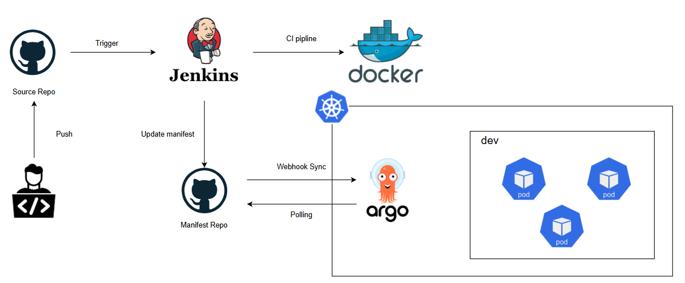

# K8S-Infra-Deploy

This repository is intended for practicing and demonstrating CI/CD workflows using Jenkins (running on Docker), ArgoCD, and deploying applications with Helm charts on Kubernetes.

## Purpose

- **CI/CD Practice**: Experiment with continuous integration and continuous deployment pipelines.
- **Jenkins on Docker**: Run Jenkins in a Docker container for easy setup and portability. Automate build, test, and deployment tasks using Jenkins.
- **ArgoCD Deployment**: Manage Kubernetes application deployments declaratively with ArgoCD.
- **Helm Charts**: Deploy and manage Kubernetes resources using Helm charts.
- **Webhooks**: Practice integrating GitHub webhooks to trigger Jenkins pipelines and ArgoCD application syncs automatically.

## Workflow


## Features

- Example Jenkins pipelines for building and deploying containerized applications.
- Jenkins setup and configuration for running inside Docker.
- ArgoCD app manifests and configurations.
- Helm charts for Kubernetes resource templating and deployment.
- Sample code and manifests to test CI/CD flows.

## Getting Started

### Prerequisites

- Docker installed
- Kubernetes cluster (local with Minikube, Kind, or remote)
- [Jenkins](https://www.jenkins.io/) (will run inside Docker)
- [ArgoCD](https://argo-cd.readthedocs.io/en/stable/) installed on your cluster
- [Helm](https://helm.sh/) installed

### Running Jenkins on Docker

1. **Start Jenkins container:**
    ```bash
    docker run -d --name jenkins \
      -p 8080:8080 -p 50000:50000 \
      -v jenkins_home:/var/jenkins_home \
      jenkins/jenkins:lts
    ```
    - Access Jenkins at [http://localhost:8080](http://localhost:8080)
    - The initial admin password can be found with:
      ```bash
      docker exec jenkins cat /var/jenkins_home/secrets/initialAdminPassword
      ```

2. **Install necessary plugins and configure Jenkins as needed.**
    - Set up Jenkins pipelines as defined in the repository (see `Jenkinsfile` or pipeline folder).
    - Ensure Jenkins has access to your Kubernetes cluster and Docker registry if applicable.

### Using Webhooks for CI/CD Automation

#### 1. Triggering Jenkins with GitHub Webhook

- Configure a webhook in your GitHub repository (Settings → Webhooks).
    - **Payload URL**: `http://<jenkins-server>:8080/github-webhook/`
    - **Content type**: `application/json`
    - **Events**: Push events (or as needed)
- Make sure Jenkins has the [GitHub plugin](https://plugins.jenkins.io/github/) installed and your jobs are set to be triggered by GitHub webhooks.

#### 2. Triggering ArgoCD Sync with Webhook

- [ArgoCD supports webhook integration](https://argo-cd.readthedocs.io/en/stable/user-guide/webhook/) to trigger application refreshes on changes.
- Configure a webhook in your GitHub repository:
    - **Payload URL**: `http://<argocd-server>/api/webhook`
    - **Content type**: `application/json`
    - **Events**: Push events (or as needed)
- You may need to configure ArgoCD to accept and authenticate webhook requests (see [ArgoCD Webhook Docs](https://argo-cd.readthedocs.io/en/stable/user-guide/webhook/)).


### Deploy with ArgoCD

- Create an ArgoCD application pointing to this repo or the relevant manifests/Helm charts.
- Sync the application from the ArgoCD dashboard or CLI.

## License

This project is for educational purposes.

---

Feel free to contribute or open issues for suggestions!
